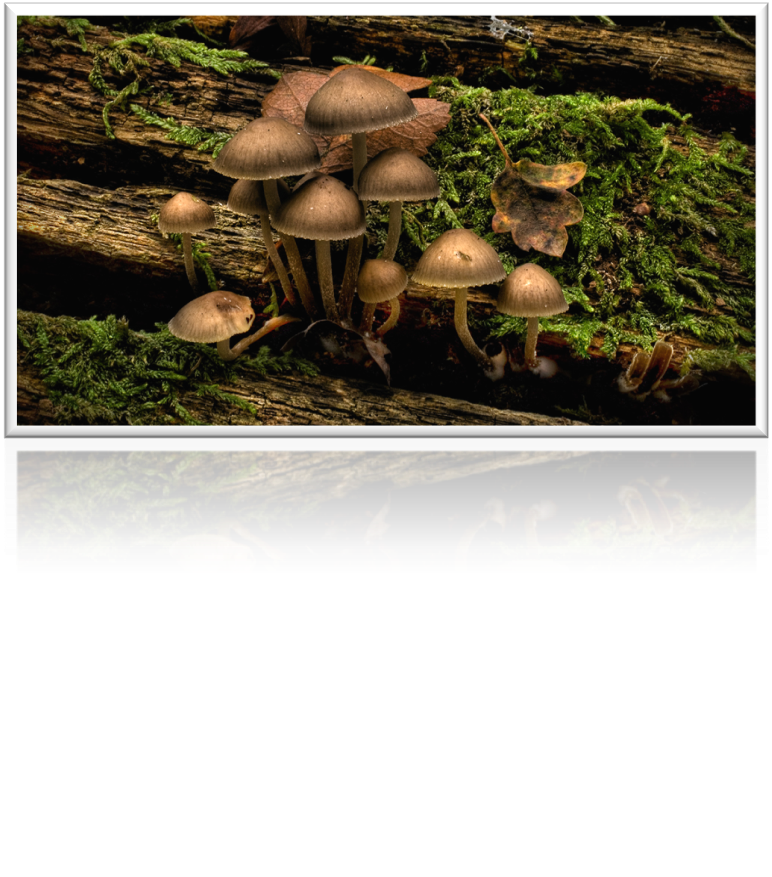
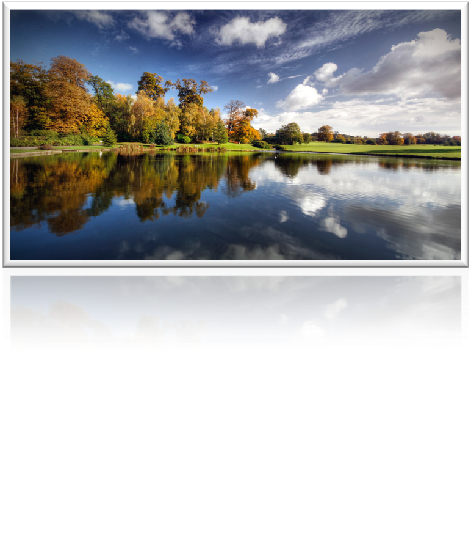
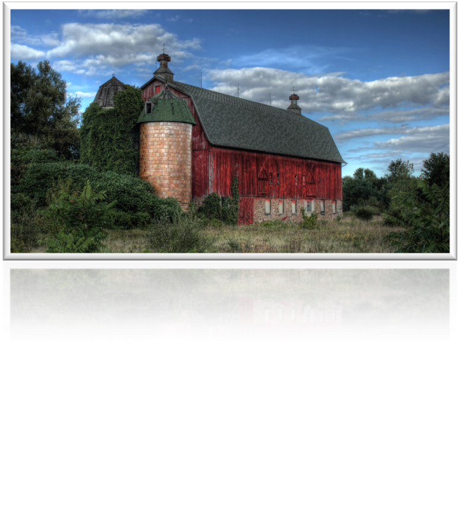
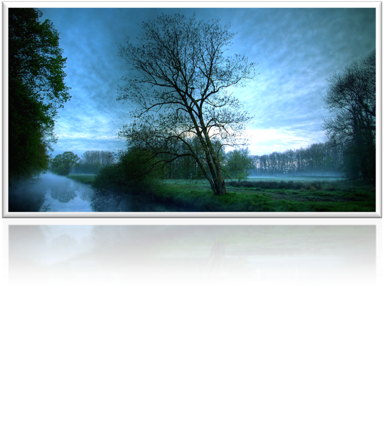
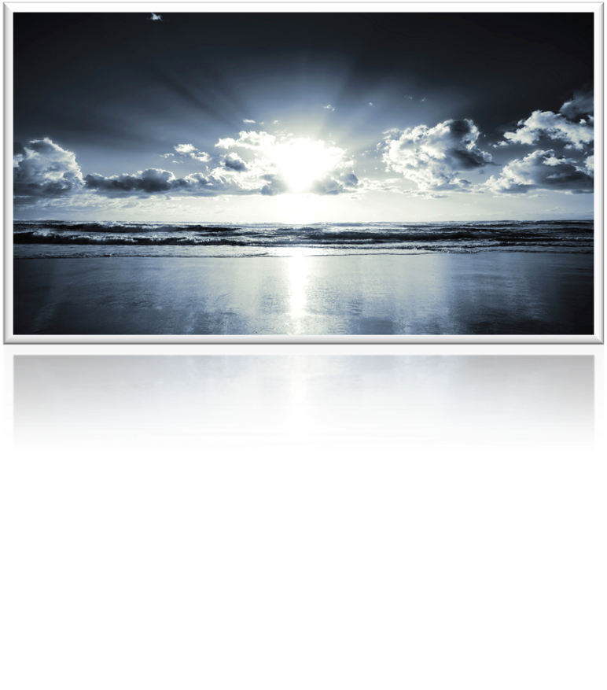
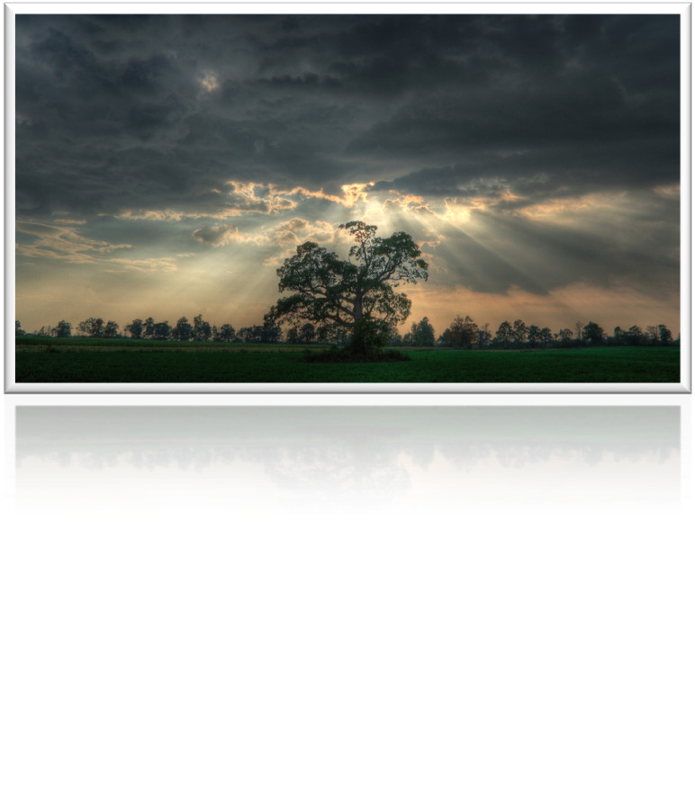
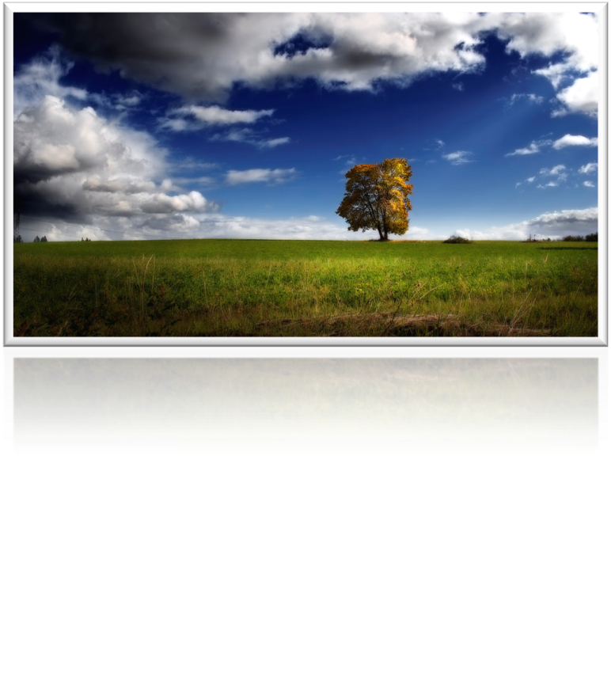

Carousel gallery
============

[jQCarousel](http://carousel.mgechev.com/) is jQuery UI plugin used for creating carousel image galleries.
It's not using canvases or SVG so it can be run under older browsers.

  * Version: 1.1.5
  * License: GPL
  * Author: [Minko Gechev](http://twitter.com/mgechev)

jQCarousel API
--------------

**Properties**

 * eccentricity: Default - 0.99. Setting carousel's eccentricity.
 * focus: Default - 300. Setting carousel's focus distance.
 * animationDuration: Default - 700. Setting the duration of the images rotation.
 * opacity: Default - true. Setting if the opacity of the images during the rotation is going to be changed,
 * resize: Default - true. Setting if the size of the images during the rotation is going to be changed.
 * angle: Default - 0. Setting the angle of the carousel.
 * minOpacity: Default - 0.2. Setting the minimum opacity of the images (this property is useful only if the opacity property is true).
 * minSizeRatio: Default - 0.3. Setting ratio which is going to control the minimum size of the images (this property is useful only if resize property is true).
 * keyboardNavigation: Default - true. Setting if the keyboard navigation is enabled.
 * imageWidth: Default - 300. Setting the maximum size of the images into the carousel.
 * direction: Default - 'shortest'. Setting the carousel rotation direction. Possible values are 'shortest', 'cw', 'ccw'.
 * enlargeWidth: Default - 500. Setting the size of the enlarged image.
 * enlargeDuration: Default - 200. Setting the duration of the enlargement.
 * closeDuration: Default - 250. Setting the duration of closing the enlarged image.
 * closeButtonSize: Default - 30. Setting the size of the close button.
 * enlargeEnabled: Default - true. Setting if the image could be enlarged.
 * enlargedOffset: Default - [0, 0]. Setting the offset of the elnarged image.

**Methods**

 * showFront: Arguments - { index: number }. Rotating the carousel so that a specific picture to be at the front.
 * enlarge: Arguments - { index: number }. Enlarging specific image.
 * removeEnlarged: Arguments - none. Closing the current enlarged image.
 * rotateRight: Arguments - { duration: number }. Rotating the carousel once with right direction.
 * rotateLeft: Arguments - { duration: number }. Rotating the carousel once with left direction.

Sample usage
------------

### JavaScript

    $(window).load(function () {
        $('#gallery').jqcarousel();
    });

### HTML

    

        
        
        
        
        
        
        
    

Contributors
------------

Author: [@mgechev](https://github.com/mgechev)
Contributor: [@hmachefe](https://github.com/hmachefe)